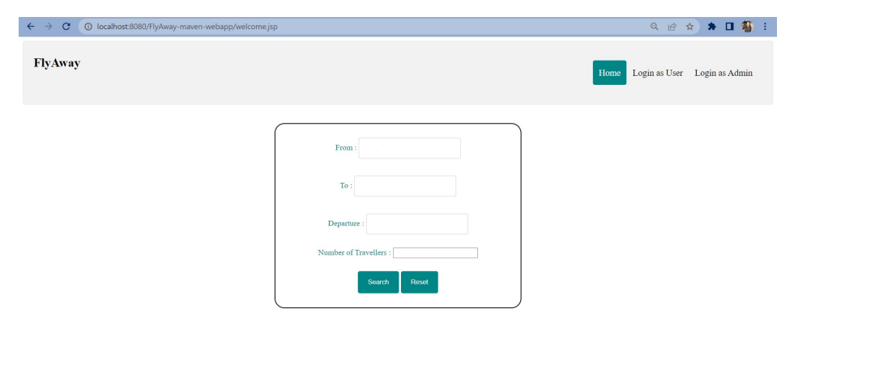
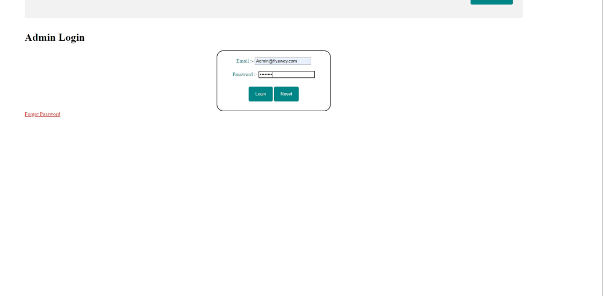

<h2 align="center">FlyAway</h2>
An online flight booking website built using Java Servlet, JSP, and Hibernate allows users to search, book, and manage flights easily. Hibernate handles database interaction for seamless booking, cancellation, and payment processes. JSP ensures dynamic content display, while Servlets manage the backend logic and user sessions efficiently.

 

### Demo Screeshots

